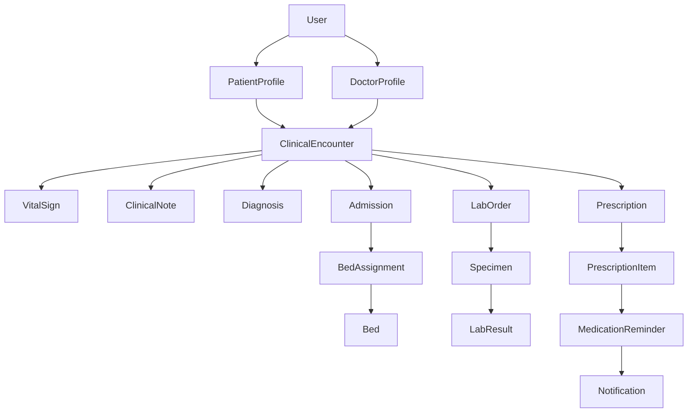

# MediNexa Post-MVP Platform Architecture & Stabilization Audit

## 1. System Overview & Monorepo Architecture

MediNexa is built as a **Modular Monolith** using modern TypeScript technologies. The repository is organized into workspace packages and applications:

```
medinexa-monorepo/
├── apps/
│   ├── api/                 # NestJS 10 REST & WebSocket API Gateway
│   └── web/                 # Next.js 14 (App Router) Frontend Dashboards
├── packages/
│   ├── config/              # Shared tsconfig & base configs
│   ├── types/               # Shared TypeScript Enums, DTOs, & Interfaces
│   └── validation/          # Shared Zod/Class-Validator schemas & RBAC helpers
└── database/
    ├── prisma/              # Prisma 5.22 Schema & PostgreSQL Migrations
    └── seed/                # Seed script & Day 2–10 Automated Integration Tests
```

---

## 2. Component Architecture Analysis

### Frontend Architecture (`apps/web`)
- **Framework**: Next.js 14 App Router (React Server & Client Components).
- **Styling**: TailwindCSS with responsive dashboard components.
- **State & API Access**: Next.js API Proxy (`rewrites` in `next.config.js`) forwarding `/api/v1/*` to `http://localhost:3001/api/v1/*`.
- **API Client**: `apiFetch` ([apps/web/lib/api-client.ts](file:///c:/Users/Tushar/OneDrive/Desktop/MediNexa/apps/web/lib/api-client.ts)) enforcing JSON response validation, automatic JWT header injection from `localStorage` (`medinexa_token`), and clean error handling.

### Backend Architecture (`apps/api`)
- **Framework**: NestJS 10 with Express platform adapter.
- **Controllers & Services**:
  - `AuthModule`: JWT-based authentication, bcrypt password hashing, role payload validation.
  - `OrganizationModule`: Facilities, Departments, Specialties, Rooms, Wards.
  - `PatientModule` & `DoctorModule`: User profile extensions and RBAC scoping.
  - `BedModule`, `AdmissionModule`: Real-time bed state machine, admission/discharge/transfer lifecycle.
  - `EncounterModule`, `LabModule`, `PharmacyModule`: EHR clinical encounters, vitals, lab orders, digital prescriptions, pharmacy dispensing.
  - `EmergencyModule`, `ReferralModule`: Dispatch management, ambulance tracking, cross-facility referrals, record authorization.
  - `AppointmentModule`, `NotificationModule`, `ReminderModule`: Schedule availability, transactional booking with lock protection, scheduled background reminder worker.
  - `AnalyticsModule`, `SearchModule`, `AiModule`: Role-scoped operational analytics, global search, and AI safety boundary wrapper.
  - `EventsModule`: WebSocket gateway for real-time alerts.

### Database & Data Persistence (`database/prisma`)
- **Database Engine**: PostgreSQL running on port 5433 (`medinexa` database).
- **ORM**: Prisma Client v5.22.0.
- **Entity Integrity**: Foreign key constraints with explicit `ON DELETE CASCADE` / `RESTRICT`, indexed lookup columns (`patientId`, `doctorId`, `facilityId`, `status`), and compound unique indices (`@@unique([doctorId, appointmentDate, startTime])`).

### Authentication & RBAC Architecture
- **Auth Tokens**: Stateless JWT Bearer tokens signed with `JWT_SECRET`.
- **RBAC Matrix**: Enforced via NestJS `@UseGuards(JwtAuthGuard, RolesGuard)` and `@Roles(...)` decorators across 9 granular system roles:
  1. `PATIENT`
  2. `DOCTOR`
  3. `NURSE`
  4. `RECEPTIONIST`
  5. `LAB_STAFF`
  6. `PHARMACY_STAFF`
  7. `AMBULANCE_DRIVER`
  8. `HOSPITAL_ADMIN`
  9. `MEDINEXA_ADMIN`

### Real-Time WebSocket Architecture
- NestJS WebSockets (`@WebSocketGateway({ namespace: 'events' })`).
- Broadcasts real-time events for bed occupancy changes, emergency dispatch updates, referral responses, and medication reminders.

---

## 3. Module Dependencies



---

## 4. Initial Stabilization Risks & Technical Debt Identified

1. **Unprotected or Inconsistently Scoped Routes**: Reviewing controllers to ensure every endpoint has `@UseGuards(JwtAuthGuard, RolesGuard)` and ownership checks (e.g. verifying `requestingUser.patientProfile.id === targetPatientId`).
2. **Database Connection Resilience**: Ensuring background timers (such as `ReminderSchedulerService`) catch database connection errors cleanly without crashing NestJS runtime.
3. **Frontend Exception Resilience**: Ensuring all dashboard pages handle empty states, loading states, and network timeouts safely.
4. **Environment Secret Hardening**: Confirming `JWT_SECRET` and database credentials are excluded from client-side bundles and Git history.
